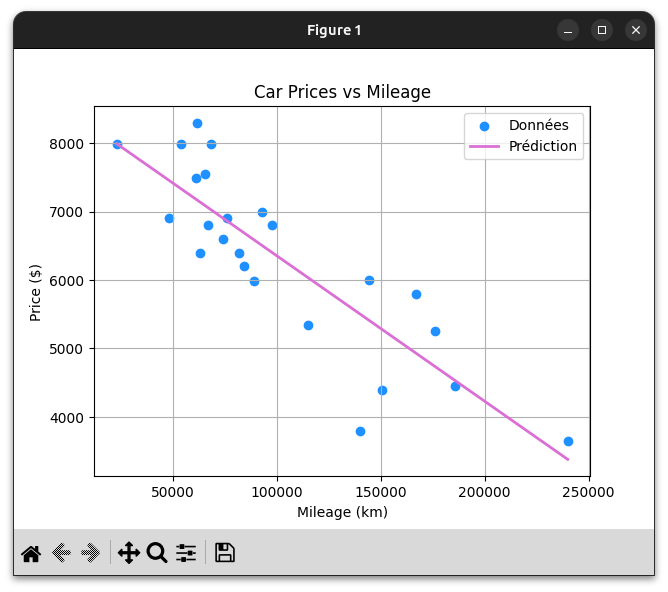

# 📈 ft_linear_regression

## 📝 Présentation
Ce projet est une introduction aux concepts fondamentaux du **Machine Learning**. L'objectif est d'implémenter un algorithme de **régression linéaire simple** pour prédire le prix d'une voiture en fonction de son kilométrage.

L'algorithme a été développé en partant de zéro (sans bibliothèques de ML comme Scikit-learn) pour comprendre la mécanique interne de la descente de gradient.

---

## 📊 Visualisation du Modèle
  
*Aperçu de la droite de régression superposée aux données d'entraînement.*

---

## 🚀 Fonctionnalités
Le projet se compose de deux scripts principaux :

1.  **`predict.py`** : Demande un kilométrage à l'utilisateur et affiche le prix estimé. Si le modèle n'a pas encore été entraîné, il considère les paramètres $\theta_0$ et $\theta_1$ comme nuls.
2.  **`train.py`** : Lit le fichier `data.csv`, effectue l'entraînement via la descente de gradient et sauvegarde les variables $\theta$ dans un fichier (ex: `model.json`).

---

## 🛠️ Concepts Mathématiques

### Fonction d'Hypothèse
Pour chaque prédiction, on utilise la formule :
$$h_{\theta}(x) = \theta_0 + (\theta_1 * x)$$

### Optimisation (Descente de Gradient)
Pour minimiser l'erreur, on met à jour simultanément les thétas à chaque itération :
* $$\theta_0 := \theta_0 - \alpha \frac{1}{m} \sum_{i=1}^{m} (h_{\theta}(x^{(i)}) - y^{(i)})$$
* $$\theta_1 := \theta_1 - \alpha \frac{1}{m} \sum_{i=1}^{m} (h_{\theta}(x^{(i)}) - y^{(i)}) \cdot x^{(i)}$$

> **Note :** La **Normalisation (Feature Scaling)** est utilisée pour transformer le kilométrage sur une échelle de 0 à 1, évitant ainsi que les calculs ne divergent à cause des valeurs trop élevées.

---

## ⚖️ Normalisation des Données (Min-Max Scaling)

Puisque les valeurs de kilométrage ($x$) sont beaucoup plus grandes que les valeurs des prix ($y$), l'algorithme de descente de gradient peut diverger si les données ne sont pas à la même échelle. Pour remédier à cela, nous appliquons une normalisation **Min-Max** :

$$x_{normalized} = \frac{x - min(x)}{max(x) - min(x)}$$

Cette étape est cruciale pour :
* Maintenir les valeurs de $x$ entre **0 et 1**.
* Assurer une convergence rapide du gradient.
* Éviter les erreurs de précision numérique (overflow).

---

## 💻 Installation & Utilisation

### 1. Cloner le projet
```bash
git clone https://github.com/ThomasHWD/Linear-Regression.git
cd ft_linear_regression
```

### 2. Installation des dépendances
```bash
# Création de l'environnement
python3 -m venv venv
source venv/bin/activate

# Installation des librairies nécessaires
pip install numpy pandas matplotlib
```

### 3. Entraîner le modèle
```bash
python3 train.py
```

### 4. Lancer une prédiction
```bash
python3 predict.py
```

---

🏁 Critères de réussite

    [x] Calcul correct des paramètres θ0​ et θ1​.

    [x] Gestion de la normalisation des données.

    [x] Affichage d'un graphique (Bonus).

    [x] Calcul de la précision du modèle (R2 ou MSE).